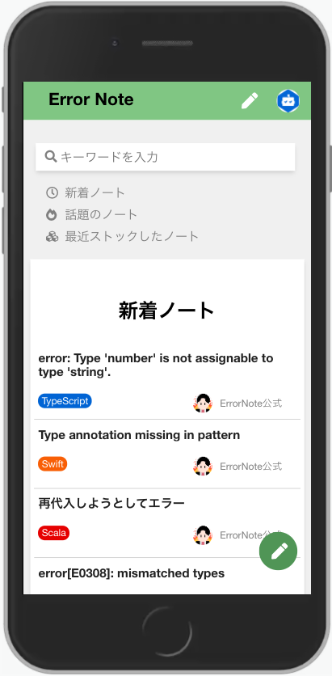

# Error Note - recording errors and solutions
&ensp;&ensp;

## What's Error Note? 🤔

Error Note was born for developers. A simple tool for recording daily errors and looking back at them later.

(In fact, Error Note was developed for my own use)

This may also contribute to people who are not good at document management.

## Composition of Error Note 🛠️

| item                 | require               | version |
| -------------------- | --------------------- | ------- |
|  OS                  | AmazonLinux AMI       | 2.0     |
|  Application Server  | Unicorn               | 6.0.0   |
|  Web Server          | Nginx                 | 1.20.0  |
|  DB Server           | AWS RDS(MySQL)        | 8.0.25  |
|  Backend             | Ruby                  | 2.7.2   |
|  BackendFramework    | Ruby on Rails         | 6.1.3.2 |
|  Frontend            | HTML, CSS, Javascript | -       |
|  FrontendFramework   | Vue.js                | 2.6.12  |
|  AutomaticDeployment | Capistrano            | 3.1.0   |

## How to use 📓

### Registration
Before you start using your notebook, please tell us a little about you.

1. Go to [Error Note's](https://www.error-note.com/) website.
1. Click the registration button at the top right of the page.
1. All you need is your name, email address, and password.
1. If you want to make your profile gorgeous, you can add images and self-introductions.
1. When you're done, click the "Register” button at the end.

Now you are ready. Ready to resolve the error?

(All information can be changed later.)

### Make a note
It happens. You'll find an error during development. 

At that time, you open Error Note without hesitation.

1. Click the round button at the bottom right
1. Tell me the title, the content of the error, and the solution.
1. Next, let's choose the language and publishing status of the system. If you keep it private, the errors you find will be your own secret.
1. Finally, press the create button to create a note.

It’s so easy, isn’t it?

### Look back later

After a while, the error will be found again.

Then you feel "I feel like the same thing happened before".

This is your chance. Open Error Note.

1. Click your icon in the header of the page.
1. There is a page dedicated to you. Here you will find all the notes you have made.
1. By clicking on the title, you will be able to refer to the notes you wrote before.

## Screen introduction 📷
### for PC

### for Phone

## Plan for improvement 📎

#### Function to find your notes
The more notes you have, the harder it can be to find.We plan to add a search function limited to your notebook in the near future.

#### Markdown Notebook
Current notebooks cannot be decorated or paste the link. This is a serious problem.
We'll evolve for your better experience.

...and more

## Try or Contribution 💻
We would appreciate it if you could contribute.We are always waiting for your participation.

### Try it
1. `git clone https://github.com/k-kudo-hub/error_note_sample.git`
1. `cd error_note_sample`
1. `bundle install`
1. `rails db:create`
1. `rails db:migrate`
1. `npm install`
1. `rails s`
1. `Access localhost:3000`

### Contribution
sorry. "How to Contribute" document is not yet complete. We will publish it as soon as it is completed.
